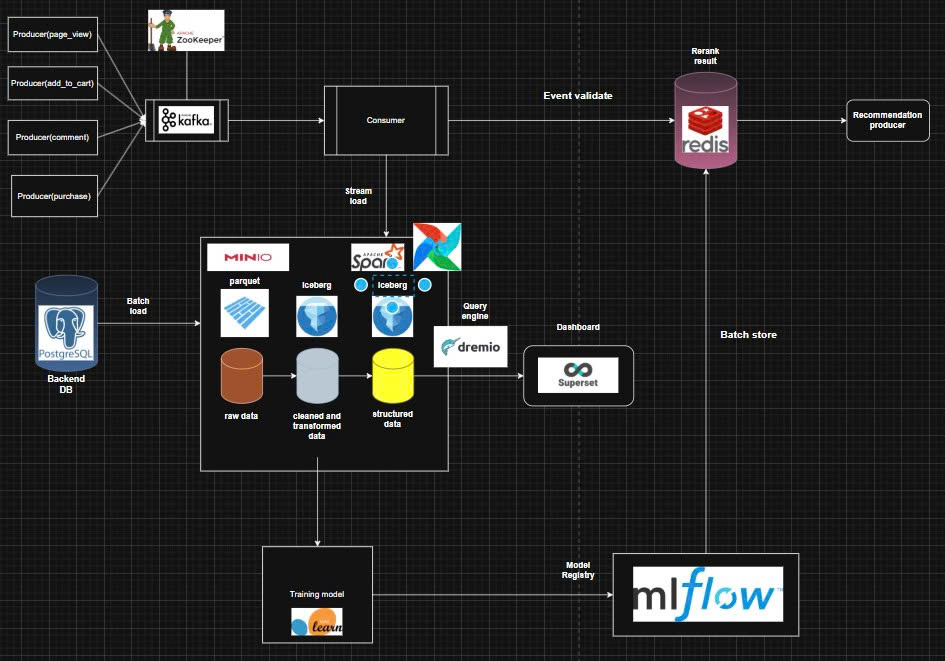

# E-commerce-lakehouse

This project proposes the development of an **E-commerce Lakehouse** that integrates **batch processing** and **real-time streaming** pipelines to support two main use cases:

* **Recommendation System** using **Collaborative Filtering (CF)** and **offline training models**.
* **Monthly Business Dashboard** for **business intelligence** and **decision-making**.

  

---

## 🧠 Project Overview

The E-commerce Lakehouse unifies data ingestion, transformation, and analytics into a single architecture that serves both **real-time operational** and **analytical workloads**.
It collects user interactions and transactional data from an e-commerce platform, processes them through a **streaming pipeline** for immediate insights and recommendations, and through **batch ETL jobs** for periodic reporting and model training.

---

## ⚙️ Architecture Components

| Component                                                 | Description                                                                                                                                            |
| --------------------------------------------------------- | ------------------------------------------------------------------------------------------------------------------------------------------------------ |
| **Producers (page_view, add_to_cart, comment, purchase)** | Capture user activity events from the e-commerce platform and publish them into Kafka topics.                                                          |
| **Kafka & ZooKeeper**                                     | Kafka acts as the central message broker for real-time data ingestion; ZooKeeper manages and coordinates Kafka brokers.                                |
| **Consumer**                                              | Consumes event streams, validates them, and routes data to both the **Redis cache** for real-time recommendations and the **data lake** for analytics. |
| **Redis**                                                 | Used for event validation and caching recommendation results to provide instant responses to end users.                                                |
| **Recommendation Producer**                               | Consumes processed data from Redis, generates recommendations, and updates the cache.                                                                  |
| **PostgreSQL (Backend DB)**                               | Stores transactional and user profile data; used as the batch data source for the lakehouse.                                                           |
| **MinIO (Data Lake Storage)**                             | Serves as the object store for raw, cleaned, and structured data layers using **Parquet** and **Iceberg** formats.                                     |
| **Apache Airflow**                                        | Orchestrates batch and stream ETL workflows, managing dependencies and scheduling data processing tasks.                                               |
| **Apache Spark**                                          | Performs distributed data transformation and feature engineering on both streaming and batch data.                                                     |
| **Dremio**                                                | Acts as a **query engine**, allowing interactive SQL queries on structured Iceberg datasets.                                                           |
| **Apache Superset**                                       | Provides visual analytics and **monthly dashboards** for sales, user engagement, and operational KPIs.                                                 |
| **Scikit-learn**                                          | Used to train collaborative filtering and machine learning models on historical user–item interactions.                                                |
| **MLflow**                                                | Handles **experiment tracking**, **model versioning**, and **deployment management** for the recommendation system.                                    |

---

## 🔁 Data Flow Overview

1. **Real-Time Streaming Pipeline**

   * User events (page views, cart actions, comments, purchases) are published to **Kafka**.
   * A **consumer** reads these events, performs validation, and stores results in **Redis** for real-time recommendation generation.

2. **Batch ETL Pipeline**

   * Data from **PostgreSQL** is periodically extracted into **MinIO** (raw zone).
   * **Spark** processes and cleans the data, outputting **Iceberg** tables (cleaned and structured zones).
   * **Airflow** orchestrates the ETL process for automated updates.

3. **Model Training and Deployment**

   * Processed data is used to train recommendation models in **Scikit-learn**.
   * Models and metrics are tracked and stored using **MLflow**.
   * Predictions and ranked results are pushed back to **Redis** for fast retrieval.

4. **Analytics and Dashboard**

   * **Dremio** queries structured Iceberg data for analytical workloads.
   * **Superset** visualizes insights in the **monthly business dashboard**.

---

## 📊 Key Features

* ✅ **Unified batch and stream data processing** using Kafka, Spark, and Airflow.
* ⚡ **Real-time recommendation engine** powered by Redis.
* 🧱 **Data lakehouse architecture** with MinIO and Apache Iceberg for scalable storage and ACID capabilities.
* 🧠 **Machine learning model tracking** and deployment via MLflow.
* 📈 **Business intelligence dashboards** for monthly KPIs and performance insights using Superset.

---

## 🧰 Tech Stack

| Category                  | Tools / Technologies           |
| ------------------------- | ------------------------------ |
| **Data Ingestion**        | Apache Kafka, ZooKeeper        |
| **Data Storage**          | MinIO, Apache Iceberg, Parquet |
| **Data Processing**       | Apache Spark, Apache Airflow   |
| **Database**              | PostgreSQL                     |
| **Query & BI**            | Dremio, Apache Superset        |
| **Machine Learning**      | Scikit-learn, MLflow           |
| **Cache / Serving Layer** | Redis                          |

---

## 📦 Future Improvements

* Integrate **real-time model retraining** with MLflow pipelines.
* Implement **user segmentation** for personalized recommendations.
* Add **CI/CD pipelines** for automated model deployment.
* Explore **Delta Lake** or **Apache Hudi** as alternative storage layers for Iceberg.

---
